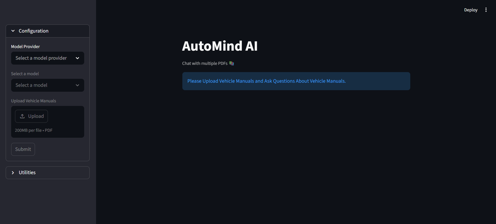

# AutoMind AI

AutoMind AI is a Generative AI-powered RAG (Retrieval-Augmented Generation) application that allows users to upload and interact with vehicle manuals and automotive documents using natural language queries.

The application processes PDF manuals, converts them into vector embeddings, stores them in a vector database, and retrieves relevant context to generate accurate AI-powered responses.

---

# Features

-  Upload and analyze vehicle manuals in PDF format
-  Ask questions about automotive documents in natural language
-  RAG-based retrieval pipeline using LangChain and ChromaDB
-  Semantic search using Hugging Face embeddings
-  Gemini-powered conversational responses
-  Interactive Streamlit-based user interface
-  Multi-PDF support for querying multiple manuals together

---

# Tech Stack

| Category | Technologies |
|----------|--------------|
| Language | Python |
| Frameworks | LangChain, Streamlit |
| LLM | Google Gemini API |
| Embeddings | Hugging Face Transformers |
| Vector Database | ChromaDB |
| Libraries | Pandas, NumPy, Matplotlib |
| PDF Processing | PyPDF |

---

# Screenshot

```md

```

---

# Project Structure

```bash
.
├── app.py
├── utils/
├── assets/
├── data/
├── requirements.txt
└── .env
```

---

# Setup Instructions

## 1. Clone the Repository

```bash
git clone https://github.com/ArnavTongia3605/AutoMind-AI.git
cd AutoMind-AI
```

---

## 2. Create Virtual Environment

```bash
python -m venv venv
```

### Activate Virtual Environment

#### Windows

```bash
venv\Scripts\activate
```

#### Mac/Linux

```bash
source venv/bin/activate
```

---

## 3. Install Dependencies

```bash
pip install -r requirements.txt
```

---

## 4. Add API Key

Create a `.env` file in the root directory and add:

```env
GOOGLE_API_KEY=your_google_api_key
```

---

## 5. Run the Application

```bash
streamlit run app.py
```

---

# How It Works

1. Upload vehicle manuals in PDF format  
2. The application extracts and chunks the document text  
3. Hugging Face embeddings are generated for semantic search  
4. Chunks are stored in ChromaDB vector database  
5. Relevant context is retrieved using RAG  
6. Gemini generates accurate responses based on retrieved content  

---

# Future Improvements

- Vehicle-specific fine-tuned assistants
- Voice-based interaction
- Multi-language manual support
- Cloud deployment
- Advanced analytics dashboard

---

# Author

Arnav Tongia
